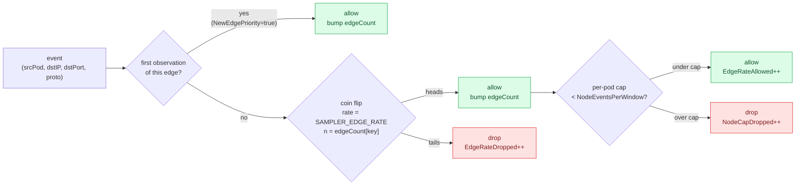

A few weeks ago, we rolled v0.6.0's spill buffer out to our own staging cluster (full story in the [companion post](https://graphon.co/blog/spill-buffer). The spill buffer fixed the data-loss problem. Then a single Grafana sidecar in our testing cluster emitted more dependency events in twelve minutes than the entire rest of the graph combined in a week. The backend held, but the graph was useless: every pane was the same hot edge repeated 80,000 times. The dependency graph was, again, lying, just in the opposite direction from before. Too much signal is just as bad as too little.

We needed `dampening`. We didn't want to lose any edges.

This is the story of how we built a sampler that doesn't drop first observations.

## The two failure modes the sampler has to handle

A K8s cluster has exactly two failure modes that matter for a dependency-event stream, and they're orthogonal:

1. `Hot edges` - A single long-lived socket (one chatty metrics pipeline, one queue consumer draining a backlog, one Kafka producer fanning out to a hundred partitions) emits thousands of events per hour for the same `(srcPod, dstIP, dstPort, protocol)` tuple. Most of those events are redundant for the dependency graph, once we know that "A -> B on TCP 5432", we know it; the next 50,000 events don't tell us anything new. But the *first* event still matters, because that's how we discover a new edge.
2. `Runaway nodes` - A boot-looping pod, a log storm, a scrape spike. One source pod emits orders of magnitude more events than its neighbors, drains the tenant's ingest quota, and starves everyone else. The right answer is a per-pod cap with a sliding window, not a global rate, because the other pods are emitting fine.

The mistake every early version of this code made was collapsing both into a single global rate. That works for the cheap case (one chatty pod), and it fails silently for the interesting one (a legitimate new dependency that happens to be on a noisy socket) because you set the rate low enough to dampen the noise and you lose the signal. We needed a sampler that knew about three things independently: per-edge rate, per-node cap, and new-edge priority.

## What the sampler actually is

The agent-side sampler is a package, ~400 lines of Go, lock-light, allocation-free on the hot path. Three knobs, all independent, all zero-safe:



The three knobs correspond to the three things the sampler knows:

| Knob | What it answers | Default |
| --- | --- | --- |
| `SAMPLER_EDGE_RATE` | "Of the non-first events for an edge, what fraction do we keep?" | `0` (1.0 once you set any knob) |
| `SAMPLER_NODE_CAP` | "Of the events from this pod in the current window, how many do we keep?" | `0` (unlimited) |
| `SAMPLER_NEW_EDGE_PRIORITY` | "Does the first observation of an edge always pass?" | `true` |
| `SAMPLER_MAX_TRACKED_EDGES` | LRU cap for the edge set | `50000` |
| `SAMPLER_MAX_TRACKED_NODES` | LRU cap for the node set | `5000` |
| `SAMPLER_NODE_WINDOW_SEC` | Sliding-window length for the per-pod cap | `60` |

The pass-through default is the thing that took us the longest to land on. A zero-valued `Config` must produce a sampler that drops nothing. The mistake is the other direction: if you set `EdgeSampleRate=0` to "drop non-first events", the pass-through default would silently drop every event including the first one. The fix is to detect "operator set nothing" and substitute `EdgeSampleRate=1.0`:

```go
// Pass-through default: a zero-valued Config must produce a no-op
// sampler so that callers don't accidentally drop every event by
// forgetting to set EdgeSampleRate. We detect "the operator set
// nothing" by checking the policy knobs that actually affect the
// sampling decision. The LRU-cap fields (MaxTrackedEdges /
// MaxTrackedNodes) and WindowDuration are not policy knobs — they
// have sane zero values we fill in below, so we deliberately do
// NOT include them in the pass-through check.
if cfg.EdgeSampleRate == 0 && cfg.NodeEventsPerWindow == 0 {
    cfg.EdgeSampleRate = 1.0
}
```

The same logic applies to `NewEdgePriority`: if you've set a sampling knob but haven't touched NewEdgePriority, we default it to `true` so the documented "first observation always passes" invariant holds. If you've explicitly set it to `false`, we honour that — you've opted out, you know what you're doing.

## The hot path, in code

The sampler's `Allow` method runs once per BPF event in the agent's consumer goroutine. The constraint is brutal: a single hash lookup, no allocation, no `math/rand` seeding. Here's the heart of it:

```go
func (s *Sampler) Allow(ev types.EnrichedEvent) bool {
    atomic.AddUint64(&s.stats.EventsConsidered, 1)

    srcIdent := ev.SrcPod
    if srcIdent == "" {
        srcIdent = ev.SrcIP
    }
    if srcIdent == "" {
        // No identity at all — let it through. We can't policy an
        // anonymous event and dropping it would lose the only signal
        // we have. This is rare: every BPF event has a source IP.
        atomic.AddUint64(&s.stats.NewEdgesAllowed, 1)
        return true
    }

    key := edgeKey{
        srcIdent: srcIdent,
        dstIP:    ev.DstIP,
        dstPort:  ev.DstPort,
        proto:    ev.Protocol,
    }

    // Fast path: first observation of an edge. NewEdgePriority
    // defaults to true; we honour the documented "always emit
    // first observation" invariant regardless of rate.
    s.mu.RLock()
    _, isFirst := s.edgeFirst[key]
    s.mu.RUnlock()
    if !isFirst && s.cfg.NewEdgePriority {
        s.recordFirst(key, srcIdent)
        atomic.AddUint64(&s.stats.NewEdgesAllowed, 1)
        return true
    }

    // Per-edge rate: deterministic, allocation-free, no math/rand.
    // We hash (key + edgeCount) so the same edge doesn't get the
    // same coin-flip every time but the sequence is reproducible
    // for a given input stream.
    if s.cfg.EdgeSampleRate < 1.0 {
        s.mu.RLock()
        n := s.edgeCount[key]
        s.mu.RUnlock()
        if !s.coinFlip(key, n) {
            atomic.AddUint64(&s.stats.EdgeRateDropped, 1)
            s.bumpEdgeCount(key)
            return false
        }
    }
    s.bumpEdgeCount(key)

    // Per-node cap: emit only if this pod is below NodeEventsPerWindow
    // events for the current window.
    if s.cfg.NodeEventsPerWindow > 0 {
        ok := s.allowNode(srcIdent)
        if !ok {
            atomic.AddUint64(&s.stats.NodeCapDropped, 1)
            return false
        }
    }
    atomic.AddUint64(&s.stats.EdgeRateAllowed, 1)
    return true
}
```

A few decisions that took longer than they should have:

1. **Read lock on the fast path.** The first-observation check takes `s.mu.RLock()`, not the write lock. The hot path is concurrent readers; the slow path is the rare recordFirst/bumpEdgeCount/allowNode that takes the write lock. Profiling the agent under load: the read-lock path is ~50ns per event on a modern x86.

2. **srcPod falls back to srcIP.** A BPF event arrives before the K8s informer has annotated the pod. The edge key needs to be stable across that window, so we fall back to `srcIP`. Once the informer annotates the pod, subsequent events use `srcPod` and the LRU correctly evicts the old IP-keyed entries.

3. **The first observation doesn't count against the per-pod cap.** The `recordFirst` path returns `true` before it touches `allowNode`. This is deliberate: the first observation is a "free discovery" event; the cap is for sustained traffic only. Otherwise a brand-new dependency on a chatty pod would be dropped, which is exactly the failure mode we're trying to avoid.

4. **coinFlip hashes (key, n) not just key.** A coin flip on `key` alone would give the same answer every time for the same edge, which at `rate=0.5` means you drop every other event deterministically (and miss half the bursty patterns). Mixing the running counter `n` into the hash means the sequence is reproducible for a given input stream but the same edge doesn't always land on the same side of the coin.

## Why FNV-1a, not math/rand

The default Go `math/rand` source is global, mutex-guarded, and seeded once at process start. Two events on two goroutines for the same edge would either contend on the lock or get the same sequence. `crypto/rand` is syscalls. We need: deterministic per edge, allocation-free per call, no contention.

The coin flip is a 32-bit FNV-1a hash of `(srcIdent, dstIP, dstPort, proto, edgeCount)` modulo `2^32`, compared against `rate * 2^32`:

```go
func (s *Sampler) coinFlip(key edgeKey, n uint64) bool {
    h := fnv.New32a()
    _, _ = h.Write([]byte(key.srcIdent))
    _, _ = h.Write([]byte{0})
    _, _ = h.Write([]byte(key.dstIP))
    var portBuf [2]byte
    portBuf[0] = byte(key.dstPort >> 8)
    portBuf[1] = byte(key.dstPort)
    _, _ = h.Write(portBuf[:])
    _, _ = h.Write([]byte(key.proto))
    var ctrBuf [8]byte
    for i := 0; i < 8; i++ {
        ctrBuf[i] = byte(n >> (8 * i))
    }
    _, _ = h.Write(ctrBuf[:])
    score := h.Sum32()
    threshold := uint32(float64(^uint32(0)) * s.cfg.EdgeSampleRate)
    return score <= threshold
}
```

Three properties that fall out for free:

1. **No allocation per call** — the hash is a value type and the byte buffers are stack-allocated.
2. **No global state** — the seed is the edge key + counter, so two goroutines for the same edge produce the same coin flip.
3. **Reproducible** — a given input stream yields the same dropped set every time, which makes the test suite deterministic without seeding workarounds.

## The per-pod sliding window

The per-node cap needs an approximate count of events per pod in the current window. A proper deque would be `O(1)` per event with `O(N)` memory for the deque. We don't need exact, a 25%-drift approximation is fine for "is this pod emitting more than its share." The answer is a tiny bucketed counter:

```go
// slidingWindow is a tiny bucketed counter. We keep N=4 buckets and rotate
// them every WindowDuration/4 so the per-pod count is approximate (within
// 25% drift) without paying for a proper deque.
type slidingWindow struct {
    buckets [4]uint64
    bucket0 time.Time
    curIdx  int
}
```

Four buckets, each covering `WindowDuration/4`. We rotate on read. Worst case can be, an event lands in a bucket that's about to be rotated out, so the per-pod count drifts by up to one bucket's worth of events. For `WindowDuration=60s` that's 15 seconds of drift on a 60-second window, which is fine for "is this pod over its cap" and saves us a heap-allocated deque per pod. The map is LRU-bounded at `MaxTrackedNodes` (default 5000) so a fleet of 10,000 pods doesn't blow up the agent's RSS.

The rotation logic:

```go
// totalLocked returns the sum across all non-stale buckets. A bucket is
// stale when it's older than WindowDuration. We rotate buckets every
// WindowDuration/4 so the worst-case drift is 25%.
func (w *slidingWindow) totalLocked(now time.Time, window time.Duration) uint64 {
    bucketDur := window / 4
    if bucketDur <= 0 {
        bucketDur = window
    }
    elapsed := now.Sub(w.bucket0)
    if elapsed >= bucketDur {
        steps := int(elapsed / bucketDur)
        if steps >= 4 {
            w.buckets = [4]uint64{}
            w.curIdx = 0
            w.bucket0 = now
            return 0
        }
        for i := 0; i < steps; i++ {
            w.curIdx = (w.curIdx + 1) % 4
            w.buckets[w.curIdx] = 0
        }
        w.bucket0 = w.bucket0.Add(time.Duration(steps) * bucketDur)
    }
    var sum uint64
    for _, b := range w.buckets {
        sum += b
    }
    return sum
}
```

## The LRU eviction story

Both the edge map and the node map are bounded. The edge map at `MaxTrackedEdges` (default 50000); the node map at `MaxTrackedNodes` (default 5000). Each map has a parallel **FIFO** slice (`edgeOrder`, `nodeOrder`) that records insertion order. When the map exceeds the cap, we pop the oldest entry off the FIFO and delete it from the map:

```go
func (s *Sampler) recordFirst(key edgeKey, srcIdent string) {
    s.mu.Lock()
    defer s.mu.Unlock()
    if _, exists := s.edgeFirst[key]; exists {
        return
    }
    s.edgeFirst[key] = struct{}{}
    s.edgeCount[key] = 0
    s.edgeOrder = append(s.edgeOrder, key)
    if len(s.edgeOrder) > s.cfg.MaxTrackedEdges {
        old := s.edgeOrder[0]
        s.edgeOrder = s.edgeOrder[1:]
        delete(s.edgeFirst, old)
        delete(s.edgeCount, old)
    }
}
```

The FIFO is `O(N)` on eviction because `s.edgeOrder[1:]` shifts the slice in place. For `MaxTrackedEdges=50000` that's a one-time `O(N)` shift, which is fine; we don't expect to evict every event. The LRU choice is FIFO-on-insertion rather than a true LRU (re-touch on access) because re-touching would require updating the FIFO on every event, which is the O(N) cost we were trying to avoid. FIFO-on-insertion is the standard sampler tradeoff and is good enough for "the agent doesn't grow unbounded over a 24-hour window."

The bound matters because the agent is a per-node DaemonSet with a `512Mi` memory limit. An unbounded sampler is an OOMKill waiting to happen, and an OOMKilled agent doesn't ship any dependency events at all.

## What the agent wires up

The agent instantiates the sampler unconditionally at startup:

```go
// Build the sampler from config. sampler.New handles the
// pass-through default for zero Config, so this is always safe
// to call.
a.sampler = sampler.New(sampler.Config{
    EdgeSampleRate:      cfg.SamplerEdgeSampleRate,
    NodeEventsPerWindow: cfg.SamplerNodeEventsPerWindow,
    WindowDuration:      cfg.SamplerNodeWindowDuration,
    NewEdgePriority:     cfg.SamplerNewEdgePriority,
    MaxTrackedEdges:     cfg.SamplerMaxTrackedEdges,
    MaxTrackedNodes:     cfg.SamplerMaxTrackedNodes,
})
if a.sampler == nil {
    // Defensive: sampler.New never returns nil, but keep the
    // invariant explicit so the event loop can skip the call
    // without a nil check.
    a.sampler = sampler.New(sampler.Config{})
}
```

The `if a.sampler == nil` defensive block is a pattern we copied from the spill buffer wiring: the agent has to be the last thing standing on the node, so every subsystem either initializes cleanly or is a silent no-op. The sampler is called once per BPF event in the consumer goroutine:

```go
// agent-side sampling policy. Runs after the per-flush dedup so each
// unique edge within a flush window gets exactly one shot at the
// sampler. The sampler tracks state across flushes, so a noisy edge
// that emits every flush will be progressively throttled per the
// configured rate. Cheap: a single hash lookup against a bounded LRU.
if !a.sampler.Allow(ev) {
    atomic.AddUint64(&a.eventsDropped, 1)
    a.mSamplerDropped.IncVec("policy")
    continue
}
```

The "runs after the per-flush dedup" comment is doing real work: within a single BPF ringbuf flush, the same edge can produce multiple events (TCP retransmits, accept storms during a deploy). The dedup collapses those to one event before the sampler sees them, so the sampler doesn't drop the first observation because the first observation was already coalesced with three other first observations for the same edge. The sampler sees one logical event per edge per flush, and the new-edge priority invariant holds.

## What the metrics look like

The agent exposes `graphon_agent_sampler_dropped_total{reason="..."}` on `:80/metrics` with two reasons:

-> `policy` — the sampler dropped this event per the configured rate or cap.

-> `dedup` — the event was collapsed by the per-flush deduplicator before reaching the sampler.
The reason label is the cheap version; for the deep picture we have the `Stats` struct:

```go
type Stats struct {
    EventsConsidered uint64 // every event the sampler was asked about
    NewEdgesAllowed  uint64 // first-observation events that always passed
    EdgeRateAllowed  uint64 // non-first events that survived per-edge rate
    EdgeRateDropped  uint64 // non-first events dropped by per-edge rate
    NodeCapDropped   uint64 // events dropped because source pod hit cap
}
```

The five counters are the audit trail for "did we lose signal we shouldn't have." If `NewEdgesAllowed` is much less than `EventsConsidered`, something is wrong (either a runaway pod is consuming the cap, or `NewEdgePriority` got disabled in config). If `EdgeRateDropped` is much larger than `EdgeRateAllowed`, your rate is set too low for the traffic. If `NodeCapDropped` is non-zero on a healthy cluster, a pod is boot-looping.

## What we'd do differently

Three things we learned writing this:

1. **Don't conflate rate and cap.** Our first version had one knob: a global rate applied to every event. It dampened hot edges and runaway nodes in the cheap case (one chatty pod). It silently dropped new edges in the interesting case (a legitimate new dependency on a noisy socket). The fix is the three-knob split we have now: edge rate for the cheap case, node cap for the runaway case, and `NewEdgePriority` as the explicit guardrail for "don't ever drop a discovery."

2. **The LRU cap matters more than the rate.** Most operators we talked to set the rate and ignored the LRU caps. Then they ran for a week and the agent OOMKilled because the map of edges grew unboundedly as the cluster churned. The default of 50000 edges is enough for ~25000 services with ~2 outbound dependencies each, which covers most staging clusters and a lot of production. Operators with bigger graphs need to bump it. We surface this in the sampler error path and the agent's startup log.

3. **`NewEdgePriority=true` is not negotiable for dependency discovery.** If you set it to `false`, `rate=0` silently drops every event including the first one, which means the graph stops discovering new dependencies. We considered making `false` the default and having a knob to opt back in; we decided against it because the failure mode is silent. Better to require an explicit opt-out than to silently break the graph invariant.

## What's still open

Two things we did *not* fix in v0.6.0:

- **Adaptive rate.** The sampler is statically configured. An adaptive rate that watches the backend's lag and tightens the rate when the backend is falling behind is a future feature. The hard part is the right adaptation signal, backend lag alone isn't enough because legitimate traffic spikes look the same as a runaway pod.
- **Per-tenant sampling policies.** Today, the sampler policy is per-cluster (one Helm values.yaml). Multi-tenant clusters with different SLAs need per-tenant policy, which means the policy moves from Helm values to a CRD or a backend-side config. The agent already has the per-edge state to enforce a per-tenant cap; we just need the policy plumbing. Tracking for v0.7.0.

The Grafana sidecar in our staging cluster still emits a lot of events. With `SAMPLER_EDGE_RATE=0.05` set on that edge, the graph now shows the dependency cleanly and the backend's ingest quota has 95% headroom for everything else. The first observation of the dependency was emitted, the graph stayed complete, and the next time a chatty pipeline lights the graph on fire, the sampler is a knob away.

If you want to see what your cluster's actual dependency graph looks like under load, the [single Helm chart](https://retr0-kernel.github.io/graphon-helm) ships everything you need in about five minutes. The Free tier includes the spill buffer, the sampler, the kernel-side TCP graph, ownership, drift detection, and safe-delete. v0.6.0 is live today.

```bash
helm repo add graphon https://retr0-kernel.github.io/graphon-helm
helm install graphon graphon/graphon-stack \
  --namespace graphon --create-namespace \
  --set neo4j.neo4j.password=$(openssl rand -hex 16)
```

— *Krish Srivastava — the Graphon team*
