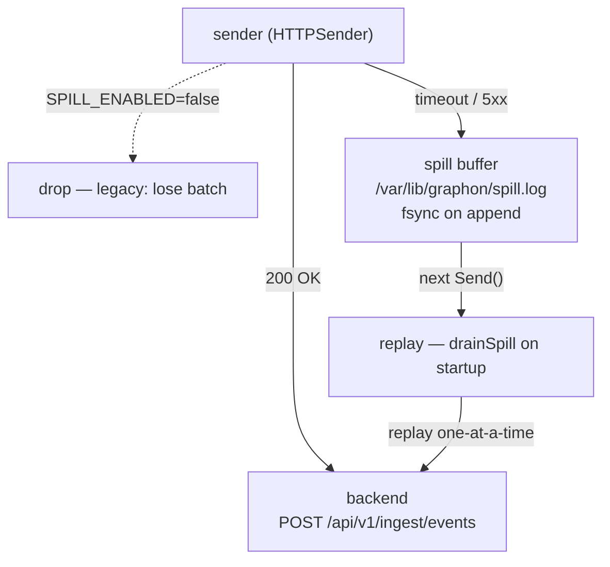
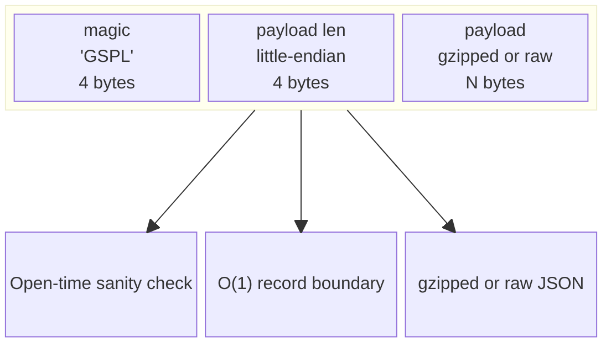
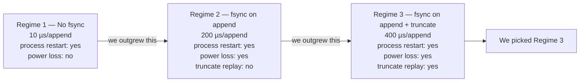

A few weeks ago, a customer sent us a support email that started:

> We have a chatty metrics pipeline in the cluster, and when we did a backend rolling restart, your agent lost about 90 seconds of dependency data. The graph showed everything as healthy for those 90 seconds, then suddenly the new connections started showing up. We didn't notice for two days.

Ninety seconds. Doesn't sound like a lot. But ninety seconds during a rolling restart is exactly the window where you're trying to figure out whether the restart itself caused a regression. The agent saw every TCP 4-tuple during that window, the BPF ring was full of events, the agent just couldn't deliver them, and then the agent got OOMKilled because it was holding a few hundred batches in memory that were all going to expire before the backend came back.

The dependency graph was, in retrospect, lying. And we knew it.

This is the story of how we fixed it.

## The eBPF ring never stops

The agent runs as a per-node DaemonSet and reads four BPF programs out of a `BPF_MAP_TYPE_RINGBUF` (`tcp_connect.bpf.c`, `net_all.bpf.c`, `tcp_lifecycle.bpf.c`, `tcp_l7.bpf.c`). The ring fills, the user-space consumer drains, the consumer hands off to a sender, the sender HTTP-POSTs to the backend at `/api/v1/ingest/events`. Every step has a different failure mode.

The eBPF ring's failure mode is: it never fails. It just keeps overwriting the oldest event. So if user-space can't keep up, you lose data, but you don't block the kernel. The HTTP sender's failure mode is: it returns an error. The whole batch is rejected, no partial success, no row-level ack.

What we did with the error used to be: log it, drop the batch, return. Two years of production telemetry taught us three things about that choice.

1. **The error was always at the worst possible time.** Backend rolling restart, network blip, ingress controller reload, all the moments where the dependency graph was most useful were the moments the sender was failing.
2. **In-memory retries don't survive a pod restart.** We tried `time.Sleep` + retry, and we tried an in-memory ring of "pending" batches. Both died the moment Kubernetes evicted the pod.
3. **The cluster was the one place we couldn't afford to lie.** The graph's job is to be honest about what the cluster is doing *right now*. Dropping the most interesting ninety seconds was the exact opposite.

So we built a `spill buffer`.

## The shape of a spill buffer

A spill buffer, in our case, is a small on-disk FIFO of "pending batches" the agent hasn't successfully delivered. On every failed HTTP POST, we append the marshalled JSON to the file with an `fsync` before we acknowledge the failure to the caller. On the next `Send`, we replay the file's contents first, oldest first, before we send any fresh traffic.

The flow looks like this in the agent:



Three properties that took us a while to land on:

1. **The file lives on a hostPath volume, not an emptyDir.** An emptyDir dies with the pod; a hostPath survives it. The agent's Helm chart mounts `/var/lib/graphon` from the host and points `SPILL_PATH` at it. The path is configurable, but `/var/lib/graphon/spill.log` is the default for a reason.
2. **`fsync` is non-negotiable for the append path, and the truncate path.** If we don't `fsync` the append, a power loss could lose a record we already said was spilled — which is worse than never having spilled it. If we don't `fsync` the truncate, a power loss could replay a record we already sent, which is a duplicate. Both `fsync`s are there, both are in the test suite.
3. **The buffer is bounded.** Default 256 MiB. When it overflows, the oldest records are evicted in LRU order. We never want the spill buffer to be the thing that OOMKills the agent.

## What the code actually looks like

The whole feature is about 450 lines of Go across three files. The interesting bits:

The sender's `Send` method always drains the spill before sending fresh traffic:

```go
func (s *HTTPSender) Send(ctx context.Context, events []types.EnrichedEvent) error {
    if len(events) == 0 && s.Spill == nil {
        return nil
    }

    // 1. Replay any previously-spilled records first. They are
    //    sent one at a time so that the first record's success
    //    doesn't accidentally acknowledge later ones.
    if s.Spill != nil {
        if err := s.drainSpill(ctx); err != nil {
            slog.Warn("sender: spill drain incomplete, continuing with fresh traffic",
                "error", err)
        }
    }

    if len(events) == 0 {
        return nil
    }

    payload := s.buildPayload(events)
    err := withRetry(ctx, func() error { /* POST */ })
    if err != nil && s.Spill != nil {
        body, _ := json.Marshal(payload)
        if aErr := s.Spill.Append(body); aErr != nil {
            slog.Error("sender: spill append failed — batch will be dropped",
                "events", len(payload.Events))
        }
        slog.Warn("sender: batch spilled to on-disk buffer for later replay",
            "events", len(payload.Events),
            "spill_path", s.Spill.Path(),
            "spill_size", s.Spill.Len())
    }
    return err
}
```

The replay path is a separate function for a reason: spilled records are sent one at a time, not in a batch. If you replay a batch of five records and the first POST returns 200, you have to assume the next four are also accepted (or, in the worst case, that you have no way to know they weren't). One-at-a-time means the success of one record doesn't accidentally acknowledge the next. If record N fails, we re-spill records N, N+1, N+2, …, all of them, oldest first.

```go
func (s *HTTPSender) drainSpill(ctx context.Context) error {
    records := s.Spill.DrainAll()
    if len(records) == 0 {
        return nil
    }

    sent := 0
    for i, body := range records {
        var payload types.IngestPayload
        if jerr := json.Unmarshal(body, &payload); jerr != nil {
            slog.Error("sender: spill record invalid JSON, dropping",
                "bytes", len(body))
            continue
        }
        if err := s.postRaw(ctx, body); err != nil {
            // Re-spill this record + all the unsent ones
            // that follow so we don't lose them.
            rest := records[i:]
            for _, r := range rest {
                if aErr := s.Spill.Append(r); aErr != nil {
                    slog.Error("sender: re-spill failed", "error", aErr)
                }
            }
            return err
        }
        sent++
    }
    if sent > 0 {
        s.Spill.AckSent(sent)
        slog.Info("sender: spill drain complete",
            "replayed", sent,
            "remaining", s.Spill.Len())
    }
    return nil
}
```

The agent wires the buffer up at startup, with a guard so the agent keeps running even if the disk is unhappy:

```go
if cfg.SpillEnabled {
    spillBuf, sErr := spill.New(spill.Config{
        Path:          cfg.SpillPath,
        MaxBytes:      cfg.SpillMaxBytes,
        FSyncOnAppend: !cfg.SpillNoFsync,
    })
    if sErr != nil {
        slog.Warn("spill buffer disabled — failed to initialise",
            "path", cfg.SpillPath, "err", sErr)
    } else {
        a.sender.Spill = spillBuf
        stats := spillBuf.Stats()
        slog.Info("spill buffer ready",
            "path", cfg.SpillPath,
            "queue_len", spillBuf.Len(),
            "replayed", stats.Replays,
            "max_bytes", cfg.SpillMaxBytes)
    }
}
```

That last guard is the one we learned to appreciate. The first time we shipped the spill buffer, we put the buffer initialisation in a place where a permission error on the hostPath would have killed the agent entirely. The agent has to be the last thing standing on the node, even if the disk is unhappy. A `slog.Warn` and a nil `Spill` pointer drops the agent back to the old drop-on-failure behaviour, which is strictly worse than spilling, but still better than a crash loop.

## The format, briefly

The on-disk file is a sequence of length-prefixed records, each with a small header:



The four-byte magic is a sanity check at open time. The length prefix means we never have to read the whole file to know where record boundaries are. The drain path uses `Seek` to walk the file in O(1) per record.

When the buffer overflows, we rewrite the file in place — keeping the in-memory queue and dropping the oldest disk records. The rewrite is atomic via `rename`, and the `fsync` of the directory entry is the last thing that happens. Power loss at any point in the rewrite leaves us with either the old file or the new file, never half of each.

## What "crash-safe" means in practice

We had a lot of internal debate about what crash-safety was worth. There are three regimes:



| Regime | Guarantee | Cost |
| --- | --- | --- |
| No `fsync` | Records survive process restart, not power loss | ~10 µs/append |
| `fsync` on append | Records survive power loss, but truncate can replay a sent record | ~200 µs/append |
| `fsync` on append + truncate | Records survive power loss, no duplicates after drain | ~400 µs/append |

We picked the third one. The 200 µs cost on the truncate path is fine because truncate happens once per drain, not once per append. The 200 µs on the append path is real money at high event rates, but high event rates are exactly when you want crash-safety. `SPILL_NO_FSYNC=true` is exposed as a knob for benchmarks; in production we don't expect anyone to use it.

## What about the latency problem?

The spill buffer fixes the data-loss problem. It does not fix the latency problem. If the backend is down for ten minutes, the spill buffer just keeps growing (up to the 256 MiB cap), and the dependency graph is ten minutes stale the whole time.

So in the same release we shipped the **edge & node sampler**. Hot edges —> a chatty metrics pipeline, a queue consumer draining a backlog, a noisy sidecar get dampened. The first observation of a new edge is always emitted (you don't want to lose "this dependency exists"), and the rest is rate-limited with a per-pod cap.

The sampler's knobs:

| Knob | Default | Purpose |
| --- | --- | --- |
| `SAMPLER_EDGE_RATE` | `0` | Fraction of subsequent edge events to keep (0.0..1.0). |
| `SAMPLER_NODE_CAP` | `0` | Per-pod cap within the window. `0` = unlimited. |
| `SAMPLER_NODE_WINDOW_SEC` | `60` | Window length for the per-pod cap. |
| `SAMPLER_NEW_EDGE_PRIORITY` | `true` | Always emit the first observation of an edge. |
| `SAMPLER_MAX_TRACKED_EDGES` | `50000` | LRU cap for the edge set. |
| `SAMPLER_MAX_TRACKED_NODES` | `5000` | LRU cap for the node set. |

All knobs default to zero, which means the sampler is a silent no-op when you don't need it. The point isn't to start sampling by default; the point is that when a noisy pipeline lights the graph on fire, you have a knob to turn.

## What we'd do differently

A handful of things we learned writing this:

1. **Don't add new persistence without a `fsync` story.** The first version of the spill buffer was `O_APPEND` with no `Sync()`. It worked in the dev cluster. It lost records in the staging cluster during a kubelet restart. The version in v0.6.0 has `fsync` on every append and on every rewrite, and the test suite has a fuzz test that simulates a `kill -9` between any two file operations.
2. **The replay path is a separate code path, not a flag.** We started with a single `Send` that took a "from spill" flag. The flag was always wrong somewhere. The replay path is now its own function, and the unit tests for it are very small and very boring.
3. **Bounded buffers need a LRU policy.** An unbounded spill buffer is an OOMKill waiting to happen. The 256 MiB cap with LRU eviction is the right answer; the question is what to evict first. Records are evicted oldest-first by write time, which means in a sustained outage you keep the most recent data. We considered evicting largest-first (to keep more records overall) and decided that freshness beat volume.
4. **Test with the disk, not against it.** The test suite has a `TestAgent_SpillBufferWiredWhenEnabled` regression guard that confirms `a.sender.Spill` is non-nil when `SpillEnabled=true`. There's also `TestAgent_SpillBufferNotWiredWhenDisabled` for the inverse. Both run as part of `go test ./...` and the CI gate blocks on them.
5. **The first deploy of the agent is the moment the spill buffer fills up.** A cluster that's been running for six months with the old drop-on-failure behaviour has no spill buffer file. The first `Send` after upgrade creates an empty file, the next failure appends a record, and the disk usage grows from there. There's no backfill, no replay of lost data, no nothing. If you've been running v0.5.x and you want v0.6.0's spill buffer, the v0.5.x data is gone. That was a deliberate choice; better a clean upgrade than a backfill that races with live traffic.

## What's still open

Two things we did *not* fix in v0.6.0:

- **Multi-node spill buffers.** The buffer is per-node. If the node dies, you lose the spill buffer file. We could replicate the buffer to a shared store (etcd, S3) but the cost is real and the failure mode is rare. Tracking for v0.7.0.
- **The replay loop is best-effort with a backoff.** If the backend is down for an hour, the replay loop tries every Send interval (default 5 seconds), and the spill buffer keeps draining whatever fits. We could be smarter here (exponential backoff on the replay path, separate from the fresh-traffic path), but the simple version is correct and good enough.

The customer's ninety-second gap is closed. The graph is honest during rolling restarts now. The next time a noisy metrics pipeline lights the graph on fire, the sampler is a knob away. And the next time the kernel keeps producing events while the backend can't take them, the spill buffer holds the line.

If you want to see what your cluster's actual dependency graph looks like before, during, and after a network incident, the [single Helm chart](https://retr0-kernel.github.io/graphon-helm) ships everything you need in about five minutes. The Free tier includes the spill buffer, the sampler, the kernel-side TCP graph, ownership, drift detection, and safe-delete. v0.6.0 is live today.

```bash
helm repo add graphon https://retr0-kernel.github.io/graphon-helm
helm install graphon graphon/graphon-stack \
  --namespace graphon --create-namespace \
  --set neo4j.neo4j.password=$(openssl rand -hex 16)
```

— *Krish Srivastava — the Graphon team*
